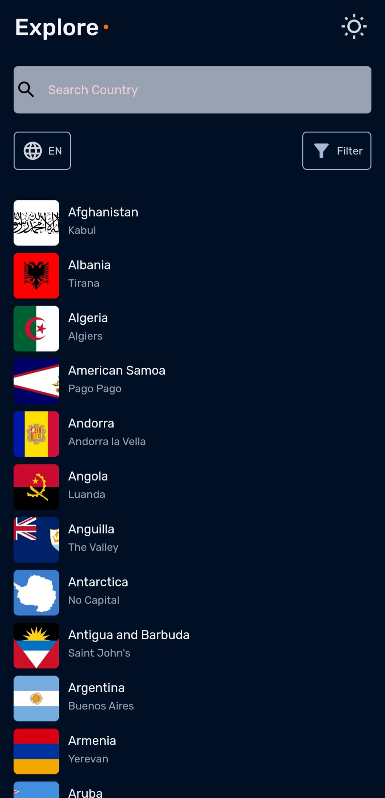
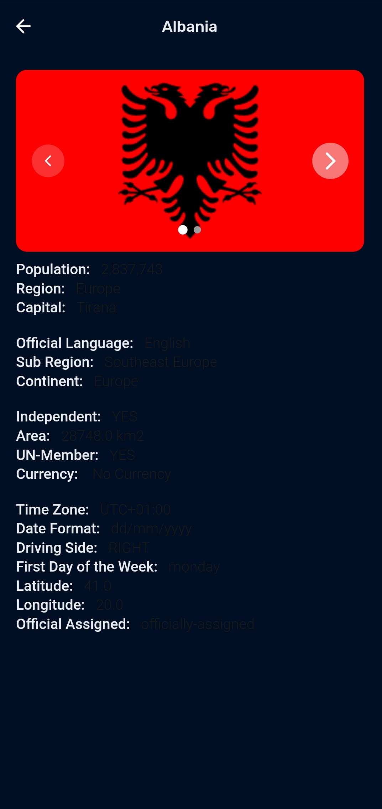
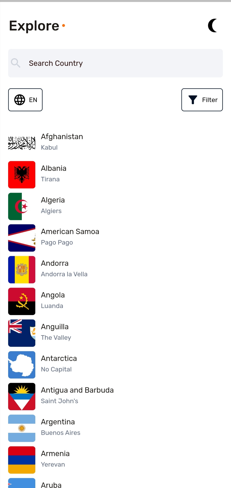

# List Of Country

This app is made for easy access to details of all the country in the world,  

## Feature
1. api integration
2. scrollable listview
3. Image slider
3. light and dark mod

## List of liberies
1. Google Fonts 
    This package is use to get aweasome font.

2. smoot page indicator 
    This package enable us to a dotted indicator when sliding the image,

3. intl 
    Provides internationalization and localization facilities

4. provider 
    This package enable us to manage our theme state

5. Shared Preference 
    This package was use, to help us store the theme data, whenever we set the theme, the hive store the current theme, so that when we close our app and open it again we will still have our current theme.

## Feature i will like to add
1. Authentication system
2. Map view ability

challenges and unsolved issues
1. Filter
2. Langueges
3. Search

- [x] Appetize.io -  https://appetize.io/app/lv3nazb5kirveouk6qwmfsaqa4?device=pixel6&osVersion=12.0&scale=75 
- [x] Apk link        https://drive.google.com/file/d/1MdyXh_K_wGbs3xiTxY_D-bbmyd93tZlT/view?usp=sharing

## Screenshot

|                                   Dark mode                                                                            | 
| -------------------------------------------------------------------------------------------------------------------    | 
|    &emsp;            | 
|   &emsp;           | 
|                                                                                                                        |
|                                                                                                                        |
